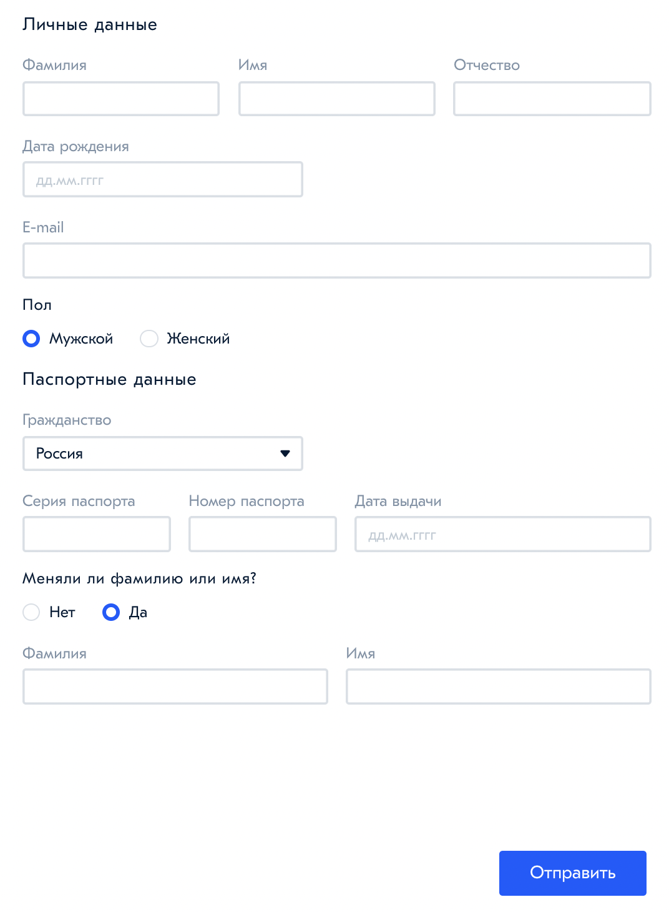

# 📝 Чек-лист

1) Ознакомьтесь с материалом лекций недели
2) Ознакомьтесь с материалами воркшопа
3) Ознакомьтесь с заданием
4) Создайте ветку `feature/…` и выполните задание в ней
5) Подготовьте PR из ветки `feature/…` в ветку `master`
6) Найдите в таблице прогресса своего тьютора
7) Отправьте личным сообщением своему тьютору ссылку на созданный PR

# Воркшоп: Работа с формами (Домашняя работа)

Необходимо сверстать форму (дизайн произвольный)

## Что сделать обязательно (✔️)

- Поля: `Фамилия`, `Имя`, `Отчество`, `Дата Рождения`, `E-mail`, `Пол`, `Гражданство` (файл *src/assets/data/citizenships.json*)
- Если гражданство **Россия**, то показывать для заполнения поля: `Серия паспорта`, `Номер паспорта` и `Дата выдачи`

- Для других гражданств показывать поля: `Фамилия на латинице`, `Имя на латинице`, `Номер паспорта`, `Страна выдачи` (файл *src/assets/data/citizenships.json*) и `Тип паспорта` (файл *src/assets/data/passport-types.json*)

- Радиокнопку `Меняли ли фамилию или имя?`
- Если ответ радиокнопки **Нет**, то ничего не показывать
- Если ответ радиокнопки **Да**, то показывайте поля: `Предыдущая Фамилия`, `Предыдущее Имя`
- При нажатии кнопки Отправить, показывать в консоли json со всеми данными

## + Посложнее (💎):

- Фильтруйте список `гражданств`, с использование текстового поиска
- Для функции фильтрации используйте throttle/deboune

## + Для профи (💎💎):

Валидируйте поля по следующим правилам:

- `Фамилия`, `Имя`, `Отчество`, `Предыдущая Фамилия`, `Предыдущее Имя`- только русские буквы
- `Дата Рождения` - валидная дата, не позже сегодняшнего числа
- `E-mail` - валидный почтовый адрес
- `Серия паспорта` - 4 цифры
- `Номер паспорта` - 6 цифр для гражданства Россия и любое значение для других гражданств
- `Фамилия на латинице` и `Имя на латинице` - только английские буквы

Валидация должна срабатывать при нажатии кнопки Отправить, а невалидные поля должны подсвечиваться